# Awesome-Emergency-Management

  

  

## 🤝 Similar Projects to Emergency Management Platforms

**Emergency Management Platforms 🛡️** support crisis preparedness 📋, incident command 🚒, mass notification 📢, resource tracking 📦, situational awareness 🗺️, and multi-agency coordination 🏛️ during emergencies and disasters 🚨. Leading commercial tools include Veoci, Noggin, Everbridge, Preparis, Crises Control, Raptor Technologies, AlertMedia, OnSolve, and DisasterLAN.

Below is a **curated list 📚** of notable platforms and their open-source equivalents. Fully featured commercial-grade mass-notification and enterprise EOC suites are limited in pure open source, but strong options exist for humanitarian response 🇺🇳, incident command, crisis mapping 🗺️, early warning 🔔, and computer-aided dispatch 📞.

### 🔍 Key Categories & SEO Keywords
- **Crisis Management & Disaster Response Software**: Systems for public safety coordination.
- **Mass Notification & Alerting**: Critical event communication tools like Everbridge and AlertMedia.
- **Incident Command System (ICS) Tools**: Emergency operations center (EOC) software.
- **Computer-Aided Dispatch (CAD)**: Resource scheduling and responder mapping.

## 🏢 SaaS / Hosted Platforms

| Platform | Description | Size (Est. Revenue/Valuation) | Pricing | Free Tier / Trial Limit |
| :--- | :--- | :--- | :--- | :--- |
| **[Everbridge](https://www.everbridge.com/)** | Leading critical event management and mass notification platform. | $1.8 Billion (Valuation) | Custom / Quote-based | No free tier (Free companion mobile apps) |
| **[AlertMedia](https://www.alertmedia.com/)** | Employee safety and emergency communication platform. | $83 Million (Revenue) | Custom / Quote-based | No free tier (Free companion mobile apps for existing enterprise accounts) |
| **[OnSolve](https://www.onsolve.com/)** | Critical communication and incident management solutions. | $50 Million (Revenue) | Custom / Quote-based | No free tier (Free trial/demo available) |
| **[Raptor Technologies](https://raptortech.com/)** | Emergency management and student safety solutions (especially for education). | $33 Million (Revenue) | Custom / Quote-based | No free tier |
| **[Noggin](https://www.noggin.io/)** | Integrated risk, emergency, and security management platform. | $21 Million (Revenue) | Custom / Quote-based | No free tier (Free trial/demo available on request) |
| **[Veoci](https://www.veoci.com/)** | Flexible emergency management and continuity platform used for incident response, planning, and operations (also referred to as Veoci EM). | $16 Million (Revenue) | Custom / Quote-based | No free tier (Demo available on request) |
| **[Preparis](https://www.preparis.com/)** | Emergency preparedness and response platform focused on planning and continuity. | $10 Million (Revenue) | Custom / Quote-based | No free tier (Free demo available) |
| **[Crises Control](https://www.crises-control.com/)** | Mass notification and crisis communication system. | $5 Million (Revenue) | Subscription (Custom) | No free tier (Free notifications via email, mobile app, and MS Teams) |
| **[DisasterLAN](https://www.disasterlan.com/)** | Emergency management and disaster recovery coordination tools. | $3 Million (Revenue) | Custom / Quote-based | No free tier (Free trial/demo available) |

## 🔓 Open-Source Software

- **[TheHive](https://github.com/TheHive-Project/TheHive)**  — Open-source security incident response platform useful for structured case management (more SOC-oriented but adaptable).
- **[Ushahidi](https://github.com/ushahidi)**  — Iconic open-source crisis-mapping and crowdsourcing platform. Aggregates reports from SMS, email, web, and social media onto maps for situational awareness during emergencies and elections.
- **FOSS Public Alert Server** + **[FOSS Warn](https://github.com/nucleus-ffm/foss_warn)**  — Open-source stack for receiving and displaying emergency alerts based on the Common Alerting Protocol (CAP). Enables privacy-friendly public alert applications.
- **[Resgrid](https://github.com/resgrid)**  — Open-source Computer-Aided Dispatch (CAD), personnel management, shift scheduling, AVL, and emergency management platform. Suitable for first-responder and departmental use.
- **[OpenEWS](https://github.com/open-ews/open-ews)**  — Open-source Early Warning System dissemination platform for sending targeted alerts (SMS, voice, etc.) to large populations. Designed for governments and NGOs.
- **[SCRIBE](https://github.com/nocomp/scribe)**  — Open-source hospital crisis management platform focused on structured, multi-site coordination during major incidents (AGPL).
- **[Sahana Eden](https://github.com/sahana/eden)**  — Mature open-source disaster and emergency management platform. Supports organizational directories, resource tracking, human resources, needs assessment, shelter management, and situation reporting. Widely used in humanitarian contexts.

### 🌐 Other Open-Source Solutions & Concepts (Non-repository / Unlinked)
- **OneUptime**, **IncidentRelay**, and similar open-source on-call / incident management tools — Primarily built for IT/SRE but can support broader incident workflows.
- **NICS / Raven** (Next-Generation Incident Command System) — Originally developed by MIT Lincoln Laboratory and later open-sourced. Supports multi-agency incident command, real-time information sharing, and common operating pictures. Variants and derivatives continue to be used by emergency services.
- Various CAP-compliant tools and aggregators that collect and redistribute official emergency alerts.

### Typical Open-Source Approach
1. **Core emergency management / EOC** — Sahana Eden or Resgrid
2. **Crisis mapping & public reporting** — Ushahidi
3. **Mass / early warning alerts** — OpenEWS or CAP-based tools
4. **Incident command & multi-agency coordination** — NICS-derived systems or Resgrid
5. **Communication** — Integration with open-source chat, SMS gateways, and existing radio systems

Open-source solutions excel in transparency, data ownership, and customization for specific jurisdictions or humanitarian use cases, though they usually require more integration effort than turnkey commercial critical-event platforms.

---

**How to contribute**  
Fork this repository, add a new project (with link + short description + category), and open a pull request.  
Prefer actively maintained open-source projects related to emergency management, crisis response, mass notification, incident command, or disaster recovery.

**License**  
This list is public domain / CC0. Feel free to copy into your own awesome list or README.

Star the projects you find useful — open emergency management tools help communities prepare and respond better! 🚨

